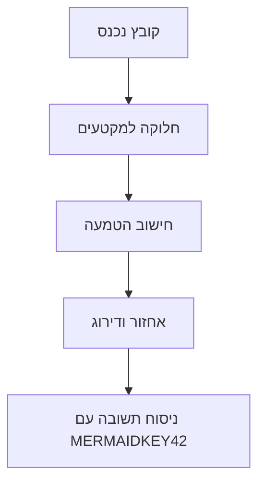

# דוח בדיקה גנרי — מערכת RAGFLOW

[כותרת-ראשית: מסמך-בדיקה-12345]

## 1. רקע

המערכת מספקת שירותי אחזור מידע מבוסס הקשר. היא תומכת בעברית מלאה.

## 2. ארכיטקטורה

הרכיב המרכזי מחלק מסמכים למקטעים, מחשב embedding, ומאחסן באינדקס וקטורי.

## 3. עיבוד מסמכים

תהליך העיבוד כולל זיהוי פריסה, חילוץ טבלאות, ותיאור תמונות.

## 4. הטמעות

מודל ההטמעה הוא bge-m3 והוא רב-לשוני.

## 5. אחזור

בעת שאילתה, המערכת מאחזרת את המקטעים הרלוונטיים ביותר לפי דמיון וקטורי.

## 6. דירוג-מחדש

שכבת דירוג-מחדש משפרת את הדיוק על ידי מיון מקטעים מועמדים.

## 7. ניסוח-תשובה

מודל שפה גדול מנסח תשובה על בסיס המקטעים שאוחזרו בלבד.

## 8. ציטוטים

כל תשובה כוללת הפניות למקורות שמהם חולצה.

## 9. העשרה

המערכת מייצרת מילות מפתח ושאלות אוטומטיות לכל מקטע.

## 10. סיכומים

שכבת raptor בונה סיכומים היררכיים של אשכולות מקטעים.

## 11. מטא-דאטה

ניתן לחלץ מטא-דאטה מובנית כגון נושא ותאריך.

## 12. ראייה-ממוחשבת

תמונות בתוך מסמכים מתוארות אוטומטית למלל.

## 13. ביצועים

זמן העיבוד תלוי בגודל הקובץ ובמספר התמונות.

## 14. אבטחה

הגישה מאובטחת באמצעות מפתח API ייחודי לכל דייר.

## 15. רב-דיירות

כל דייר מבודד עם אינדקס ומודלים משלו.

## 16. תאימות

השירות נגיש דרך HTTP API סטנדרטי בפורמט JSON.

## 17. שפות

המערכת תומכת בעברית, אנגלית, וערבית.

## 18. מגבלות

גודל מקטע מרבי הוא 2048 אסימונים.

## 19. תחזוקה

יש לנטר את תור המשימות של מעבדי הרקע.

## 20. סיכום

RAGFLOW הוא שירות RAG גנרי המתאים למגוון פרויקטים.

## טבלת מפרט טכני

| רכיב | ערך | יחידה |
|---|---|---|
| גודל מקטע מרבי | 2048 | אסימונים |
| מודל הטמעה | bge-m3 | - |
| מספר דיירים נתמך | 500 | דיירים |
| זמן תגובה ממוצע | 850 | מילישניות |
| קוד-סודי-בטבלה | ZX9871 | מזהה |

## תרשים זרימה

## תרשים מכירות רבעוני

התמונה לעיל מציגה נתוני מכירות רבעוניים.
